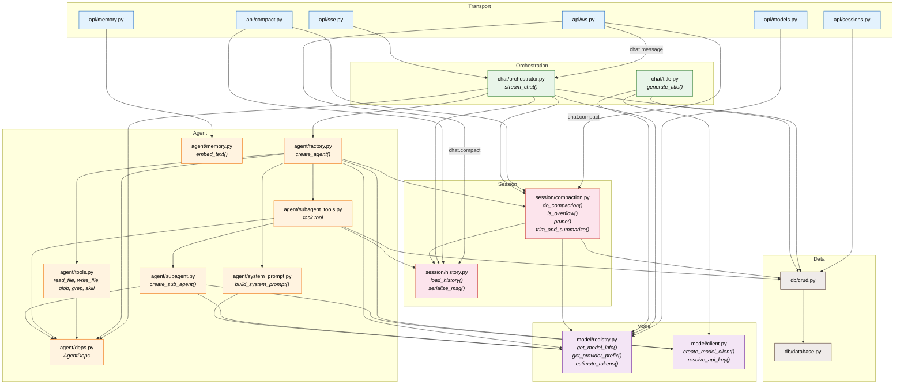

# 09 — Session 多轮对话模块调用图

本文档描述一个 Session 的多轮对话生命周期中，各模块之间的调用关系。

---

## 1. 模块分层架构

```
┌─────────────────────────────────────────────────────┐
│                    Transport Layer                   │
│                    api/ (ws, sse)                    │
├─────────────────────────────────────────────────────┤
│                  Orchestration Layer                  │
│              chat/ (orchestrator, title)              │
├──────────────┬──────────────────────┬───────────────┤
│  Agent Layer │   Session Layer      │   Model Layer  │
│  agent/      │   session/           │   model/       │
│  (factory,   │   (history,          │   (registry,   │
│   tools,     │    compaction)       │    client)     │
│   subagent)  │                      │                │
├──────────────┴──────────────────────┴───────────────┤
│                   Data Layer                          │
│              db/ (database, crud, models)             │
└─────────────────────────────────────────────────────┘
```

**依赖规则**：上层可调用下层，不可反向调用。同层之间通过公开接口调用。

---

## 2. 模块依赖关系图



---

## 3. 多轮对话时序图

下面展示一个 Session 中 **3 轮对话**的完整调用流程：
- **Turn 1**：首条消息，触发标题生成
- **Turn 2**：工具调用（包含子 Agent）
- **Turn 3**：上下文溢出，触发自动压缩

```mermaid
sequenceDiagram
    participant Client
    participant WS as api/ws.py
    participant ORCH as chat/orchestrator
    participant FACTORY as agent/factory
    participant MODEL as model/client
    participant HIST as session/history
    participant COMP as session/compaction
    participant TGEN as chat/title
    participant TOOLS as agent/tools
    participant SUBT as agent/subagent_tools
    participant SUB as agent/subagent
    participant DB as db/crud

    Note over Client,DB: ═══ WebSocket 连接建立 ═══

    Client->>WS: WS Connect /ws/{session_id}
    WS-->>Client: Connection Accepted

    Note over Client,DB: ═══ Turn 1: 首条消息 + 标题生成 ═══

    Client->>WS: {"type":"chat.message","content":"帮我写个测试"}
    WS->>ORCH: stream_chat(session_id, content, send_event)

    ORCH->>DB: get_session(session_id)
    DB-->>ORCH: session{model_id, system_prompt}
    ORCH->>DB: create_message(session_id, "user", content)
    ORCH->>DB: list_messages(session_id)
    ORCH->>HIST: load_history(messages[:-1])
    Note right of HIST: 解析 model_messages_json<br/>→ List[ModelMessage]
    HIST-->>ORCH: history=[] (首轮为空)

    ORCH->>FACTORY: create_agent(model_id, system_prompt)
    FACTORY->>MODEL: create_model_client(...)
    FACTORY->>FACTORY: register_tools(agent)
    FACTORY-->>ORCH: agent

    rect rgb(245,245,245)
        Note over ORCH,TOOLS: LLM 流式响应循环
        loop agent.iter() → ModelRequestNode
            ORCH-->>WS: stream.delta / thinking.delta
            WS-->>Client: {"type":"stream.delta","text":"..."}
        end
    end

    ORCH->>DB: create_message(session_id, "assistant", full_text)
    ORCH->>COMP: is_overflow(model_id, tokens_used)
    COMP-->>ORCH: false (首轮不会溢出)
    ORCH->>HIST: serialize_msg(all_messages)
    ORCH->>DB: update_message(assistant_id, model_messages_json=...)

    ORCH-->>WS: stream.done
    WS-->>Client: {"type":"stream.done","usage":{...}}

    Note right of ORCH: 首轮 + title=="New Chat"<br/>→ 异步生成标题
    ORCH-->>TGEN: asyncio.create_task(generate_title)
    TGEN->>MODEL: create_model_client(model_id)
    TGEN->>DB: update_session(session_id, title="...")
    TGEN-->>WS: session.title_updated
    WS-->>Client: {"type":"session.title_updated","title":"..."}

    Note over Client,DB: ═══ Turn 2: 工具调用 + 子 Agent ═══

    Client->>WS: {"type":"chat.message","content":"搜索代码里的 bug"}
    WS->>ORCH: stream_chat(session_id, content, send_event)

    ORCH->>DB: get_session(session_id)
    ORCH->>DB: create_message(session_id, "user", content)
    ORCH->>DB: list_messages(session_id)
    ORCH->>HIST: load_history(messages[:-1])
    Note right of HIST: 反序列化 Turn 1 的<br/>model_messages_json
    HIST-->>ORCH: history=[...]

    ORCH->>FACTORY: create_agent(model_id, system_prompt)
    FACTORY-->>ORCH: agent

    rect rgb(255,243,224)
        Note over ORCH,TOOLS: LLM 调用工具 (glob/grep)
        loop agent.iter() → CallToolsNode
            ORCH->>DB: create_tool_call(assistant_id, "grep", args)
            ORCH-->>WS: tool.call
            WS-->>Client: {"type":"tool.call","tool_name":"grep"}
            TOOLS-->>ORCH: tool result
            ORCH->>DB: update_tool_call(db_id, result, status="done")
            ORCH-->>WS: tool.result
            WS-->>Client: {"type":"tool.result","result":"..."}
        end
    end

    rect rgb(255,228,225)
        Note over ORCH,SUB: LLM 调用 task 工具 (子 Agent)
        loop CallToolsNode → task tool
            ORCH-->>WS: tool.call
            WS-->>Client: {"type":"tool.call","tool_name":"task"}
            SUBT->>DB: create_session(parent_id=session_id)
            SUBT->>DB: create_task_record(...)
            SUBT-->>WS: task.started
            WS-->>Client: {"type":"task.started"}

            SUBT->>SUB: create_sub_agent(sub_def, model_id, work_dir)
            SUB->>MODEL: create_model_client(...)
            SUB-->>SUBT: sub_agent

            SUBT->>DB: list_messages(sub_session_id)
            SUBT->>HIST: load_history(messages)
            Note right of SUBT: 子 Agent 流式运行
            loop sub_agent.iter()
                SUBT-->>WS: stream.delta (wrapped with task_id)
                WS-->>Client: {"type":"stream.delta","task_id":"..."}
            end

            SUBT->>DB: create_message(sub_session_id, "assistant", text)
            SUBT->>DB: update_task_record(status="completed")
            SUBT-->>WS: task.completed
            WS-->>Client: {"type":"task.completed"}
            SUBT-->>ORCH: XML task result
        end
    end

    ORCH->>DB: update_message(assistant_id, model_messages_json=...)
    ORCH->>COMP: is_overflow(model_id, tokens_used)
    COMP-->>ORCH: false (尚未溢出)
    ORCH-->>WS: stream.done
    WS-->>Client: {"type":"stream.done","usage":{...}}

    Note over Client,DB: ═══ Turn 3: 上下文溢出 → 自动压缩 ═══

    Client->>WS: {"type":"chat.message","content":"继续重构剩余模块"}
    WS->>ORCH: stream_chat(session_id, content, send_event)

    ORCH->>DB: get_session(session_id)
    ORCH->>DB: create_message(session_id, "user", content)
    ORCH->>DB: list_messages(session_id)
    ORCH->>HIST: load_history(messages[:-1])
    Note right of HIST: 加载 Turn 1+2 的完整历史<br/>trim_and_summarize 作为<br/>history_processor 过滤
    HIST-->>ORCH: history=[...]

    ORCH->>FACTORY: create_agent(model_id, system_prompt)
    FACTORY-->>ORCH: agent

    rect rgb(245,245,245)
        Note over ORCH,TOOLS: LLM 流式响应 + 工具调用
        loop agent.iter()
            ORCH-->>WS: stream.delta / tool.call / tool.result
            WS-->>Client: events...
        end
    end

    ORCH->>DB: update_message(assistant_id, ...)
    ORCH->>COMP: is_overflow(model_id, tokens_used)
    COMP-->>ORCH: true (overflow!)

    rect rgb(252,228,236)
        Note over ORCH,DB: 自动压缩流程
        ORCH->>COMP: do_compaction(db, session_id, model_id, all_msgs)
        COMP->>COMP: _find_previous_summary(all_msgs)
        COMP->>COMP: select(messages, model_id)
        Note right of COMP: 将历史分为 head(压缩)<br/>和 tail(保留最近)
        COMP->>COMP: process_compaction(head, model_id)
        COMP->>COMP: _generate_summary(head, model_id)
        Note right of COMP: 创建临时 Agent 调用 LLM<br/>生成对话摘要
        COMP-->>COMP: summary
        COMP->>DB: create_message(is_compaction=True)
        COMP->>DB: create_message(is_summary=True, summary)
        COMP->>HIST: serialize_msg(summary_model_msg)
        COMP->>DB: update_message(summary_msg_id, model_messages_json=...)
        COMP-->>WS: compaction.done
        WS-->>Client: {"type":"compaction.done","summary_message_id":"..."}
    end

    ORCH->>COMP: prune(all_messages)
    Note right of COMP: 替换旧 tool result<br/>为 placeholder
    ORCH->>HIST: serialize_msg(pruned_messages)
    ORCH->>DB: update_message(assistant_id, model_messages_json=...)

    ORCH-->>WS: stream.done
    WS-->>Client: {"type":"stream.done","usage":{...}}

    Note over Client,DB: ═══ 手动压缩 (可选) ═══

    Client->>WS: {"type":"chat.compact"}
    WS->>DB: list_messages(session_id)
    WS->>HIST: load_history(messages)
    WS->>COMP: do_compaction(db, session_id, model_id, history)
    COMP->>DB: create_message(is_compaction, is_summary)
    COMP-->>WS: compaction.done
    WS-->>Client: {"type":"compaction.done"}
```



---

## 4. 关键函数调用索引

| 函数 | 所在模块 | 调用者 |
|------|---------|--------|
| `stream_chat()` | `chat/orchestrator.py` | `api/ws.py`, `api/sse.py` |
| `create_agent()` | `agent/factory.py` | `chat/orchestrator.py` |
| `create_model_client()` | `model/client.py` | `agent/factory.py`, `agent/subagent.py`, `chat/title.py` |
| `resolve_api_key()` | `model/client.py` | `agent/factory.py`, `agent/subagent.py`, `chat/title.py` |
| `load_history()` | `session/history.py` | `chat/orchestrator.py`, `api/ws.py`, `api/compact.py`, `agent/subagent_tools.py` |
| `serialize_msg()` | `session/history.py` | `chat/orchestrator.py`, `session/compaction.py` |
| `do_compaction()` | `session/compaction.py` | `chat/orchestrator.py`, `api/ws.py`, `api/compact.py` |
| `is_overflow()` | `session/compaction.py` | `chat/orchestrator.py` |
| `prune()` | `session/compaction.py` | `chat/orchestrator.py` |
| `trim_and_summarize()` | `session/compaction.py` | `agent/factory.py` (作为 history_processor) |
| `generate_title()` | `chat/title.py` | `chat/orchestrator.py` (asyncio.create_task) |
| `build_system_prompt()` | `agent/system_prompt.py` | `agent/factory.py` |
| `create_sub_agent()` | `agent/subagent.py` | `agent/subagent_tools.py` |
| `register_task_tools()` | `agent/subagent_tools.py` | `agent/factory.py` |
| `register_file_tools()` | `agent/tools.py` | `agent/factory.py`, `agent/subagent.py` |
| `register_search_tools()` | `agent/tools.py` | `agent/factory.py`, `agent/subagent.py` |
| `register_skill_tools()` | `agent/tools.py` | `agent/factory.py`, `agent/subagent.py` |

---

## 5. 数据流向

### 5.1 消息持久化流程

```
用户消息
  │
  ▼
crud.create_message(role="user")     ← 立即持久化
  │
  ▼
agent.iter(user_message, history)    ← LLM 处理
  │
  ├── stream.delta ──→ send_event ──→ Client (实时)
  ├── tool.call ──→ crud.create_tool_call ──→ send_event ──→ Client
  ├── tool.result ──→ crud.update_tool_call ──→ send_event ──→ Client
  │
  ▼
crud.create_message(role="assistant")  ← 首个 text chunk 时创建
  │
  ▼
crud.update_message(model_messages_json=...)  ← 流结束后更新
  │
  ▼
stream.done ──→ Client
```

### 5.2 历史加载流程 (多轮)

```
Turn N 开始
  │
  ▼
crud.list_messages(session_id)     ← 获取所有 DB 消息
  │
  ▼
messages[:-1]                      ← 排除刚创建的用户消息
  │
  ▼
load_history(messages)             ← 从最新消息的 model_messages_json 反序列化
  │
  ▼
trim_and_summarize(history)        ← history_processor: 截断 [Conversation Summary] 之前的内容
  │
  ▼
agent.iter(msg, message_history)   ← 传入历史 + 当前消息
```

### 5.3 压缩触发链路

```
stream_chat 完成
  │
  ├── is_overflow(model_id, total_tokens) ──→ true
  │     │
  │     ▼
  │   do_compaction(db, session_id, model_id, all_msgs, send_event)
  │     ├── _find_previous_summary(all_msgs)  ← 查找旧摘要
  │     ├── select(all_msgs, model_id)        ← head/tail 分割
  │     ├── _generate_summary(head, ...)      ← LLM 生成摘要
  │     ├── crud.create_message(is_compaction=True)
  │     ├── crud.create_message(is_summary=True)
  │     └── send_event({type: "compaction.done"})
  │
  ├── prune(all_messages)            ← 替换旧工具结果为 placeholder
  │
  └── serialize_msg(pruned) ──→ crud.update_message(model_messages_json=...)
      │
      ▼
  下次 Turn 的 load_history() 会加载压缩后的历史
```

---

## 6. 跨模块调用统计

| 调用方模块 | 被调用模块 | 调用次数 | 说明 |
|-----------|-----------|---------|------|
| `chat/orchestrator` | `session/compaction` | 3 | `is_overflow`, `do_compaction`, `prune` |
| `chat/orchestrator` | `session/history` | 2 | `load_history`, `serialize_msg` |
| `chat/orchestrator` | `agent/factory` | 1 | `create_agent` |
| `chat/orchestrator` | `model/registry` | 1 | `get_model_info` |
| `chat/orchestrator` | `db/crud` | 6+ | 会话/消息/工具调用的 CRUD |
| `agent/factory` | `model/client` | 2 | `resolve_api_key`, `create_model_client` |
| `agent/factory` | `model/registry` | 2 | `get_model_info`, `get_provider_prefix` |
| `agent/factory` | `session/compaction` | 1 | `trim_and_summarize` |
| `agent/subagent_tools` | `session/history` | 1 | `load_history` |
| `agent/subagent` | `model/client` | 2 | `resolve_api_key`, `create_model_client` |
| `session/compaction` | `model/registry` | 3 | `estimate_tokens`, `get_model_info`, `get_provider_prefix` |
| `session/compaction` | `session/history` | 1 | `serialize_msg` |
| `api/ws` | `chat/orchestrator` | 1 | `stream_chat` |
| `api/ws` | `session/compaction` | 1 | `do_compaction` (手动压缩) |
| `api/ws` | `session/history` | 1 | `load_history` (手动压缩) |
